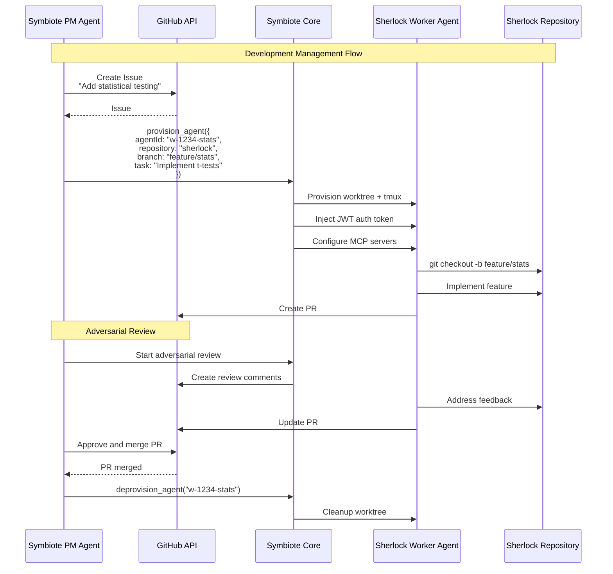
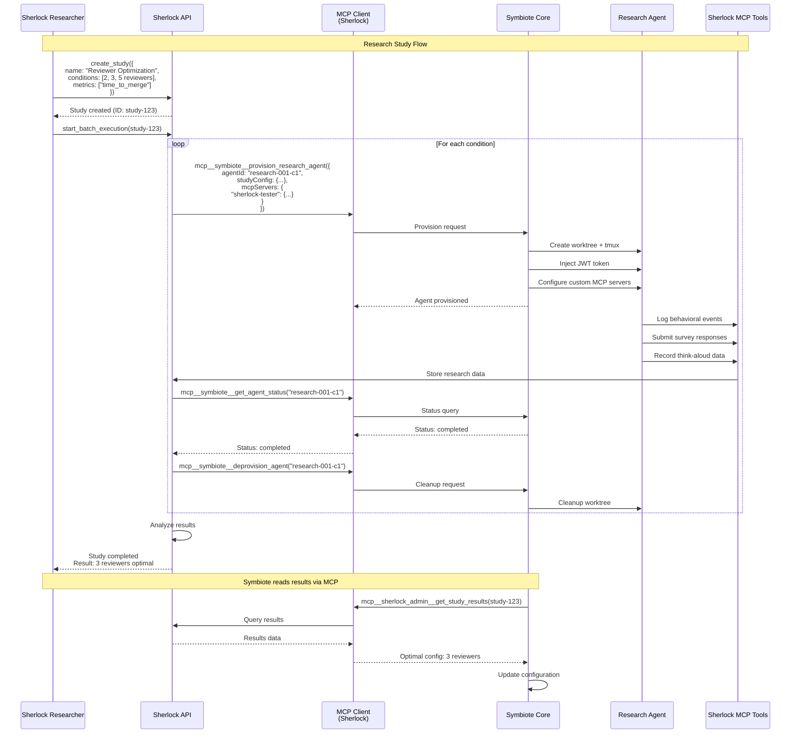
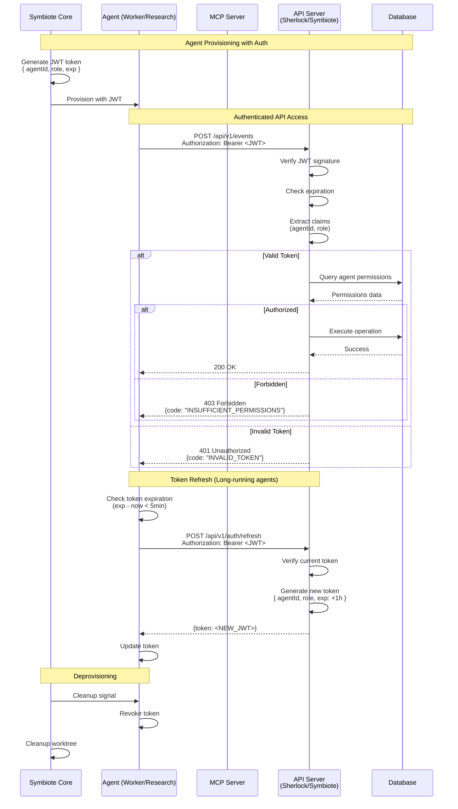
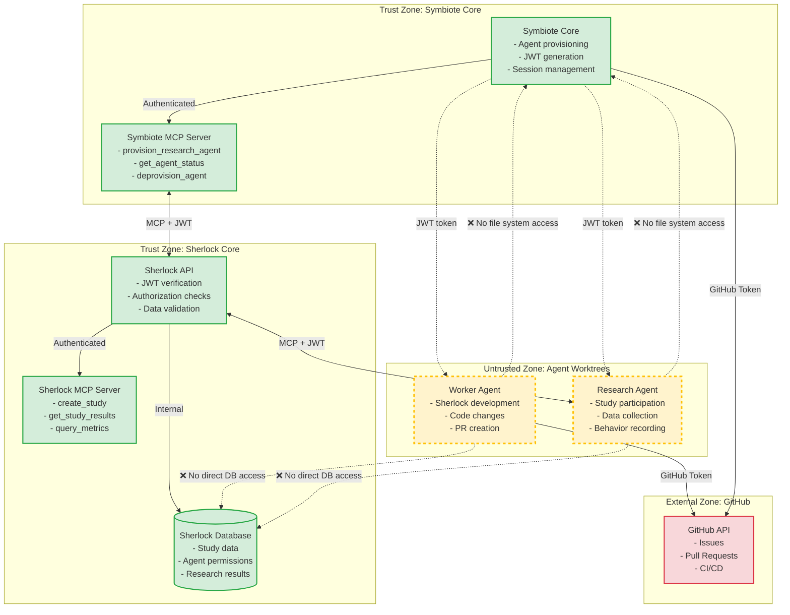

# RFC-001: Symbiote-Sherlock Integration Architecture

**Status:** Draft
**Author:** Assistant (with John)
**Created:** 2024-11-21
**PR:** #[TBD]

## Executive Summary

This RFC proposes an integration architecture between Symbiote (agent orchestration platform) and Sherlock (research evaluation platform) that maintains clean separation of concerns while enabling bidirectional value creation through a recursive improvement loop.

## Motivation

Currently, we have three distinct systems with overlapping concerns around agent management:

1. **Symbiote** - Production agent orchestration, SDLC automation, adversarial reviews
2. **Sherlock** - Research platform for evaluating agent strategies and behaviors
3. **Story/CharacterAnimation** - Domain-specific agentic workflows

Without clear architectural boundaries, we risk:
- Feature pollution (research metrics in production systems)
- Duplicated agent management code
- Missed opportunities for recursive improvement

## Proposed Architecture

### Core Principle: Clean Separation with Bidirectional Value

```
Symbiote (Orchestration)
    ↓ manages development of →
Sherlock (Research)
    ↓ evaluates effectiveness of →
Symbiote's agent strategies
    ↓ improvements flow back to →
Symbiote (Better Orchestration)
```

### System Boundaries

#### Symbiote Owns
- Agent provisioning (worktrees, tmux, JWT auth)
- Inter-agent communication
- GitHub integration (PRs, issues, CI)
- Session management & restoration
- Adversarial review orchestration

#### Sherlock Owns
- Study design & batch execution
- Metrics collection & analysis
- Agent behavior definitions
- Comparative experiments
- Domain-specific tools (story API, think-aloud)

#### Neither Owns the Other's Code
- No Sherlock libraries imported into Symbiote
- No Symbiote orchestration code in Sherlock
- All integration via MCP tools

## Integration Points

### 1. Symbiote → Sherlock (Development Management)

Symbiote manages Sherlock like any other project:

```typescript
// Symbiote PM Agent creates Sherlock issue
{
  title: "Add statistical significance testing",
  repository: "my-symbiotic-ai/sherlock",
  assignee: "w-1234-stats-feature"
}

// Symbiote provisions worker for Sherlock
await provision_agent({
  agentId: "w-1234-stats-feature",
  repository: "sherlock",
  branch: "feature/statistical-testing",
  task: "Implement t-test and p-value calculations"
})
```

### 2. Sherlock → Symbiote (Research Evaluation)

Sherlock evaluates Symbiote's effectiveness:

```typescript
// Sherlock requests research agents from Symbiote
await mcp__symbiote__provision_research_agent({
  agentId: "research-001",
  studyId: "reviewer-optimization",
  mcpServers: {
    "sherlock-tester": {
      // Custom MCP tools for research
    }
  }
})

// Sherlock studies Symbiote's strategies
const study = await create_study({
  name: "Optimal Reviewer Configuration",
  conditions: [
    { reviewers: 2 },
    { reviewers: 3 },
    { reviewers: 5 }
  ],
  metrics: ["convergence_rate", "quality_score", "time_to_merge"]
})
```

## MCP Tool Extensions

### Symbiote MCP Tools (for Sherlock to call)

```typescript
interface SymbioteResearchTools {
  // Provision agent for research
  provision_research_agent(config: {
    agentId: string
    studyConfig: StudyConfig
    mcpServers: Record<string, McpServerConfig>
  }): Promise<AgentProvisionResult>

  // Monitor research agent
  get_agent_status(agentId: string): Promise<AgentStatus>

  // Clean up after study
  deprovision_agent(agentId: string): Promise<void>
}
```

### Sherlock MCP Tools (for Symbiote to call)

```typescript
interface SherlockAdminTools {
  // Create evaluation study
  create_study(config: StudyDefinition): Promise<Study>

  // Get results for optimization
  get_study_results(studyId: string): Promise<StudyResults>

  // Query specific metrics
  query_metrics(studyId: string, metricType: string): Promise<Metrics>
}
```

## Implementation Phases

### Phase 1: Foundation (Week 1)
- [ ] Symbiote: Add `provision_research_agent` MCP tool
- [ ] Symbiote: Support custom MCP server injection
- [ ] Sherlock: Create Symbiote MCP client
- [ ] Sherlock: Replace `claude-code-agent-manager.ts` with delegation

### Phase 2: Self-Management (Week 2)
- [ ] Symbiote PM creates Sherlock GitHub issues
- [ ] Symbiote workers implement Sherlock features
- [ ] Adversarial review on Sherlock PRs
- [ ] Track metrics on agent-developed code quality

### Phase 3: Self-Evaluation (Week 3)
- [ ] Sherlock study: Optimal reviewer configuration
- [ ] Sherlock study: Validator model selection
- [ ] Sherlock study: Tech debt threshold calibration
- [ ] Symbiote reads results and adjusts configuration

### Phase 4: Production Loop (Week 4)
- [ ] Automated optimization cycle
- [ ] Cross-project learning (Story, CharacterAnimation)
- [ ] Continuous improvement metrics
- [ ] Documentation and best practices

## Success Metrics

### Architectural Cleanliness
- Zero Sherlock code imported in Symbiote
- Zero Symbiote orchestration code in Sherlock
- All integration via documented MCP tools

### Operational Effectiveness
- Symbiote optimization decisions based on Sherlock data
- Sherlock features successfully shipped by Symbiote agents
- Reduced human intervention over time

### Value Creation
- Symbiote gains: Quantitative evaluation of agent strategies
- Sherlock gains: Managed development by production agents
- Both gain: Recursive improvement cycle

## Example: Recursive Improvement Cycle

```
Day 1: Symbiote uses 5 reviewers (slow)
  ↓
Day 7: Sherlock study shows 3 reviewers optimal
  ↓
Day 8: Symbiote updates to 3 reviewers
  ↓
Day 14: Faster merges → more Sherlock features
  ↓
Day 21: Better Sherlock → more accurate studies
  ↓
Day 28: More accurate studies → better Symbiote
  ↓
∞ Continuous improvement
```

## Feature Request Flow

When Symbiote needs new Sherlock capabilities:

1. **Request**: Symbiote PM creates GitHub issue
2. **Implementation**: Symbiote worker implements feature
3. **Review**: Adversarial agents review code
4. **Merge**: Feature ships to Sherlock
5. **Usage**: Symbiote uses new capability via MCP
6. **Value**: Both systems improve

## Risks and Mitigations

### Risk: Circular Dependencies
**Mitigation**: Strict MCP-only integration, no code sharing

### Risk: Evaluation Bias
**Mitigation**: Sherlock studies use synthetic tasks, not Symbiote's own code

### Risk: Complexity Explosion
**Mitigation**: Phased implementation, clear boundaries, focused scope

### Risk: Security Boundaries
**Mitigation**: All agent communication through authenticated MCP tools, JWT tokens for agent identity, no direct file system access between systems

## Alternatives Considered

### Alternative 1: Merge Everything into Symbiote
- **Pros**: Single system, no integration needed
- **Cons**: Feature pollution, loss of focus, massive complexity
- **Decision**: Rejected - violates separation of concerns

### Alternative 2: Keep Systems Completely Separate
- **Pros**: Maximum isolation, no dependencies
- **Cons**: Duplicate agent management, no optimization loop
- **Decision**: Rejected - misses recursive improvement opportunity

### Alternative 3: Sherlock as Symbiote Plugin
- **Pros**: Closer integration, shared infrastructure
- **Cons**: Coupling, harder to evolve independently
- **Decision**: Rejected - MCP provides sufficient integration

## Decision

We will implement the proposed architecture with:
1. Clean separation via MCP-only integration
2. Symbiote managing Sherlock development
3. Sherlock evaluating Symbiote effectiveness
4. Recursive improvement through bidirectional feedback

## Implementation Timeline

- **Week 1**: Foundation - MCP integration setup
- **Week 2**: Self-management - Symbiote manages Sherlock
- **Week 3**: Self-evaluation - Sherlock evaluates Symbiote
- **Week 4**: Production loop - Continuous improvement

## Future Considerations

### Extended Integration
- Story project using Sherlock for narrative evaluation
- CharacterAnimation using Sherlock for retopology strategies
- All managed by Symbiote agents

### Advanced Optimization
- Automated A/B testing of agent strategies
- Machine learning on evaluation results
- Self-tuning configuration based on metrics

### Ecosystem Growth
- Other projects adopting Symbiote for orchestration
- Sherlock as general research platform for AI agents
- Standardized MCP tools for agent evaluation

## References

- Symbiote Repository: https://github.com/my-symbiotic-ai/symbiote
- Sherlock Repository: https://github.com/my-symbiotic-ai/sherlock
- MCP Protocol: https://modelcontextprotocol.io

## Appendix: Integration Example

```typescript
// Complete integration example

// 1. Symbiote detects performance issue
const issue = await symbiote.detectPerformanceIssue()
// "Adversarial reviews taking too long"

// 2. Symbiote creates Sherlock issue
await github.createIssue({
  repo: "sherlock",
  title: "Study: Optimal reviewer count for convergence speed",
  body: "Need to evaluate 2, 3, 5 reviewer configurations"
})

// 3. Symbiote assigns worker agent
await symbiote.provision_agent({
  agentId: "w-5678-reviewer-study",
  repository: "sherlock",
  task: "Implement reviewer configuration study"
})

// 4. Agent implements study in Sherlock
// ... development happens ...

// 5. Study runs using Symbiote for agent provisioning
const results = await sherlock.run_study({
  name: "Reviewer Configuration",
  provision_via: "symbiote"
})

// 6. Symbiote reads results
const optimal = await mcp__sherlock_admin__get_study_results(study.id)
// Results: 3 reviewers optimal

// 7. Symbiote updates configuration
await symbiote.updateConfig({
  adversarial_reviewers: {
    default_count: 3
  }
})

// 8. Both systems improved
// - Symbiote: Faster reviews
// - Sherlock: New study capability
```

## Data Flow Diagrams

> **Note**: These diagrams represent the proposed integration architecture as of the RFC design phase. Implementation details may evolve during development. Please update these diagrams if actual design differs significantly from what is documented here.

### 1. Symbiote → Sherlock: Task Delegation Flow

This diagram shows how Symbiote manages Sherlock's development lifecycle through GitHub issues and agent provisioning.



### 2. Sherlock → Symbiote: Evaluation Flow

This diagram shows how Sherlock requests research agents from Symbiote to evaluate agent strategies.



### 3. Authentication and Authorization Flow

This diagram shows how agents authenticate across system boundaries using JWT tokens.



### 4. Security Boundaries and Trust Zones

This diagram shows the security boundaries between systems and the trust model.



### 5. Complete Recursive Improvement Loop

This diagram shows the full cycle of improvement between Symbiote and Sherlock.

```mermaid
graph LR
    subgraph "Week 1-2: Development"
        A[Symbiote PM<br/>Creates Issue] --> B[Provision Worker<br/>Agent]
        B --> C[Implement<br/>Sherlock Feature]
        C --> D[Adversarial<br/>Review]
        D --> E[Merge PR]
    end

    subgraph "Week 3: Evaluation"
        E --> F[Sherlock Study<br/>Runs]
        F --> G[Collect Metrics<br/>& Data]
        G --> H[Analyze Results]
    end

    subgraph "Week 4: Optimization"
        H --> I[Symbiote Reads<br/>Results]
        I --> J[Update Symbiote<br/>Configuration]
        J --> K[Improved Agent<br/>Strategies]
    end

    subgraph "Continuous Loop"
        K --> L[Better Sherlock<br/>Features]
        L --> M[More Accurate<br/>Studies]
        M --> N[Better Symbiote<br/>Optimization]
        N --> A
    end

    style A fill:#e1f5ff
    style F fill:#fff3cd
    style I fill:#d4edda
    style K fill:#d4edda
    style L fill:#e1f5ff
    style M fill:#fff3cd
    style N fill:#d4edda
```



> **Note on Convergence**: While the diagram shows a continuous recursive loop, in practice the optimization cycle will have convergence criteria to prevent infinite iterations. Suggested criteria: continue iterations until performance improvement is less than 5% over 2 consecutive cycles, or until a maximum of 10 major optimization cycles is reached. Each optimization decision should be data-driven based on study results with statistical significance testing.

### Data Transformation Points

| Flow Stage | Data Format | Security Check | Example |
|------------|-------------|----------------|---------|
| **Symbiote → GitHub** | REST API JSON | GitHub token | `{title, body, assignee}` |
| **Symbiote → Agent** | Shell environment | JWT injection | `SHERLOCK_TOKEN=eyJhbG...` |
| **Agent → Sherlock API** | REST API JSON + JWT | Token verification | `Authorization: Bearer <jwt>` |
| **Sherlock → Database** | SQL queries | Input validation | Parameterized queries |
| **Sherlock → MCP Client** | MCP protocol | JWT in context | `{studyId, config}` |
| **MCP Client → Symbiote** | MCP tools | JWT verification | `provision_research_agent()` |
| **Symbiote → MCP Server** | MCP response | Rate limiting | `{agentId, status}` |

### Security Boundary Enforcement

1. **Authentication**: All cross-system calls require JWT tokens
2. **Authorization**: Role-based access control (RBAC) at API level
3. **Isolation**: Agents run in separate worktrees with no direct system access
4. **Validation**: All inputs validated at API boundaries
5. **Auditing**: All agent actions logged with timestamps and agent IDs
6. **Rate Limiting**: API requests throttled to prevent abuse
7. **Token Expiration**: JWT tokens expire after 1 hour, require refresh

## Sign-off

This RFC represents a collaborative design between human expertise and AI assistance, validated through extensive discussion and architectural analysis.

**Proposed by:** Assistant + John
**Date:** 2024-11-21
**Status:** Awaiting Review